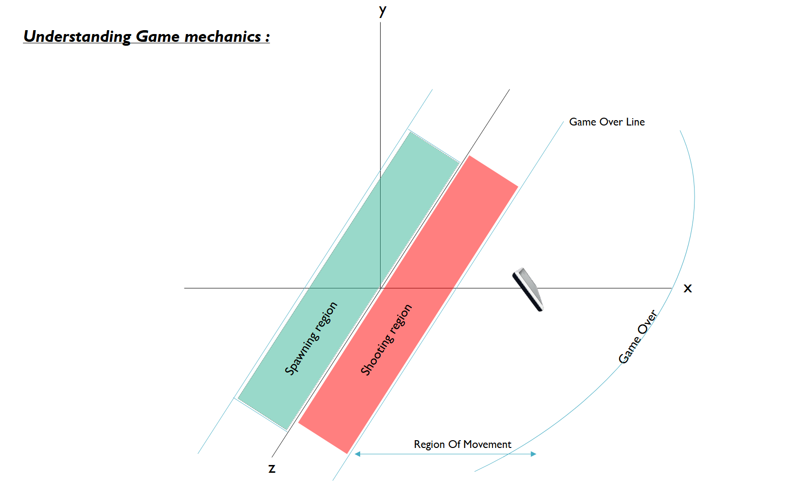
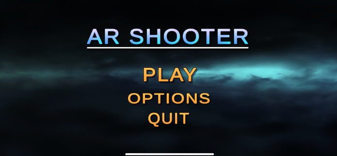
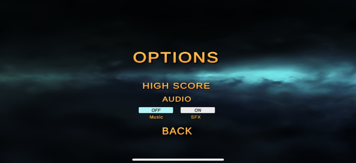
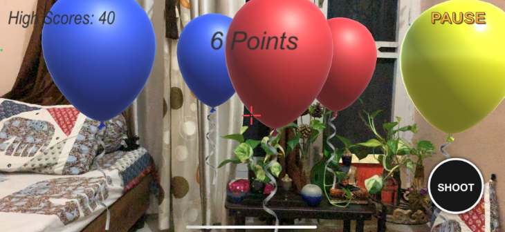
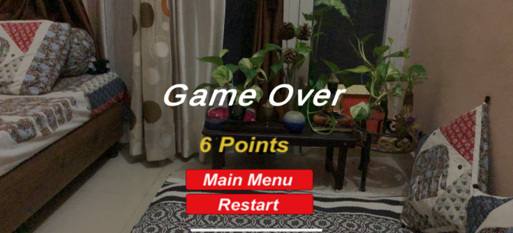
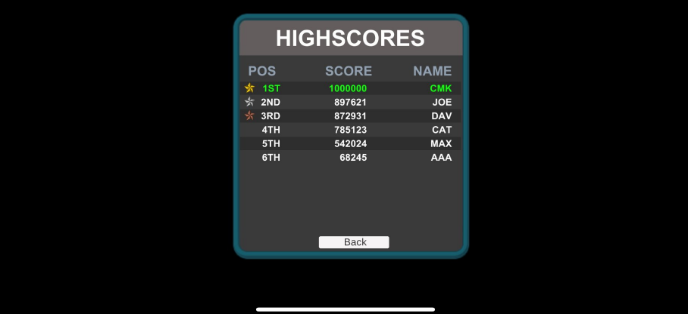

# 🎯 AR Shooter

> An Augmented Reality balloon-shooting game built with Unity and ARKit for iOS. Move freely in your real environment, aim at targets, and test your reflexes while blending the virtual and physical worlds.

---

## 📌 Overview

**Motivation:**  
Being an avid gamer, I wanted to create a title that breaks the conventional “sit-and-play” style of gaming. AR Shooter leverages Augmented Reality to get players moving in their actual surroundings while still enjoying digital gameplay.

**Scope:**  
- With further work, AR Shooter can be expanded into a VR experience.  
- AI integration could enhance target behavior and player interaction for a more dynamic challenge.

---

## 🛠️ Why Unity 3D?

- **Cross-platform** support and flexibility.
- **Graphics capabilities** for immersive visual effects.
- **Rich Unity Asset Store** for faster prototyping.
- **Physics & collision libraries** for target movement and hit detection.
- **SQL integration** for high score management.

---

## 📈 Game Mechanics

The game defines distinct zones for spawning targets, shooting them, and restricting player movement to prevent escaping gameplay boundaries.

  

---

## ✨ Features

- AR gameplay powered by **Unity ARKit XR**.
- Balloon targets with varied colors & movement patterns.
- Score tracking with persistent high score management.
- Movement restrictions to ensure fairness.
- Intuitive touch-based shooting.
- Menu, options, and game-over flow.

---

## 🖼️ Screenshots

  
  
  

  
  

---

## 🎮 How to Play

1. **Move your device** to look around your environment.
2. **Locate balloon targets** within the shooting region.
3. Tap the **Shoot** button to pop balloons and score points.
4. Avoid moving past the **Game Over Line**.
5. Beat your own high score!

---

## 🛠️ Installation & Build (iOS)

**Requirements:**
- macOS with **Xcode 15+**
- iOS device supporting **ARKit** (iPhone 6s or newer)
- Apple Developer account for deployment

**Steps:**
1. Clone the repo.
2. Open `Unity-iPhone.xcodeproj` in Xcode.
3. Set up **Team** and **Bundle Identifier** in Signing & Capabilities.
4. Connect your device and build (`⌘R`).

---

## 🙌 Credits

- **Unity** Game Engine  
- **Apple ARKit**  
- All assets & code created by [Abhay Mahajan](https://github.com/Abhayooo7)

